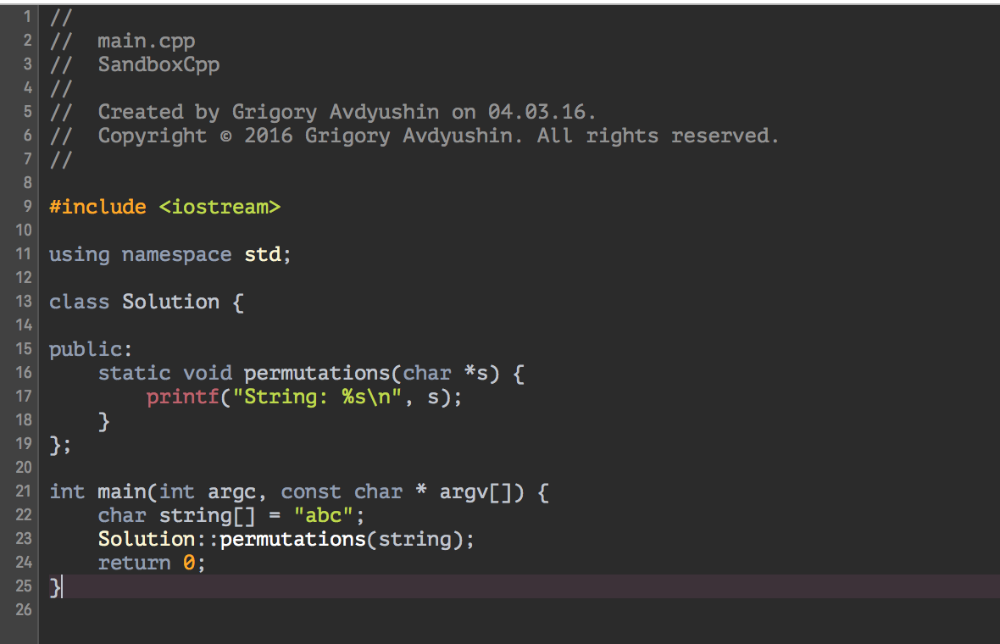

# XcodeMustangTheme
Xcode Mustang color theme

## Installation

In `Terminal.app`

Copy colortheme file to Xcode's user data:

```
cp ~/Desktop/Mustang.dvtcolortheme ~/Library/Developer/Xcode/UserData/FontAndColorThemes
```

If directory does not exists, create it first:

```
mkdir ~/Library/Developer/Xcode/UserData/FontAndColorThemes
```

Based on [Mustang Vim theme](http://hcalves.deviantart.com/art/Mustang-Vim-Colorscheme-98974484)


