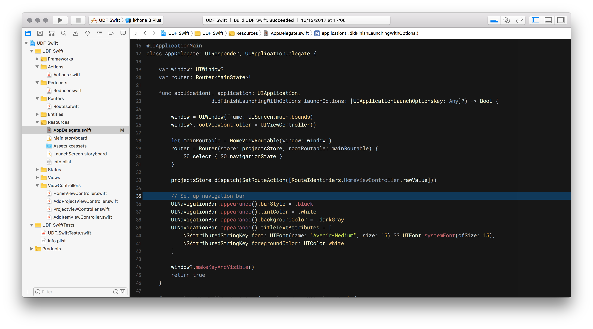
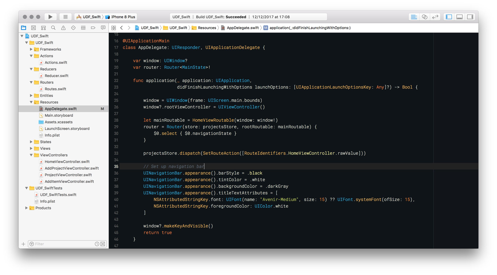

# Xcode colour themes

This repository contains my favourite Mustang and Ayu2 colour themes.

## How to install

Copy colour theme files to Xcode's user data:

```
cp *.dvtcolortheme ~/Library/Developer/Xcode/UserData/FontAndColorThemes
```

## Original themes

* Mustang based on [Mustang Vim theme](http://hcalves.deviantart.com/art/Mustang-Vim-Colorscheme-98974484)
* Ayu2 based on [Ayu theme](https://github.com/dempfi/ayu)

## Screenshots

### Mustang


### Ayu 2


## Font

Font on the screenshorts is [Roboto Mono](https://fonts.google.com/specimen/Roboto+Mono)
